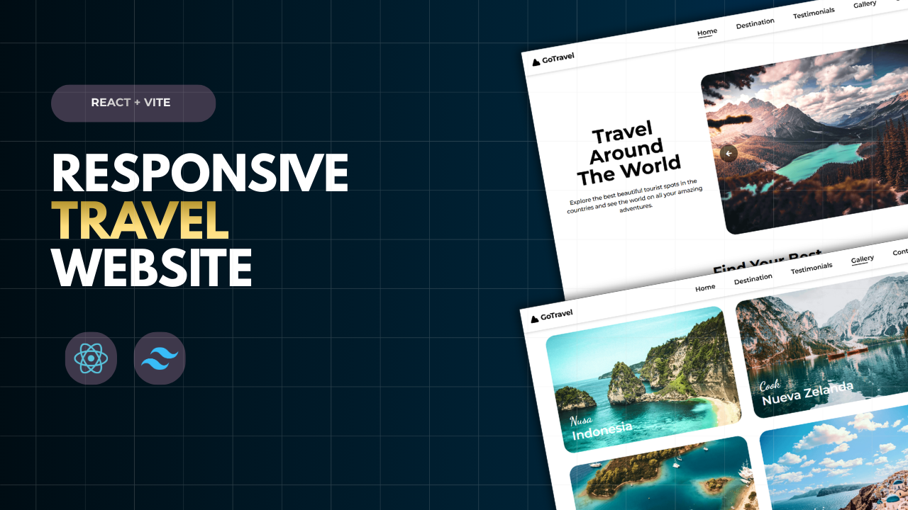

# 🌍 GoTravel

GoTravel is a simple travel-themed website built using **React, Vite, and Tailwind CSS**.
This project was created to practice React component structure, responsive layouts, and modern frontend development.

The website mainly showcases travel destinations with beautiful images and a clean UI.

---

🚀 **Live Demo :** [GoTravel Website](https://go-travel-01.vercel.app/)

---

## 📸 Preview


---

## 🚀 Features

* Responsive navigation bar
* Mobile menu toggle
* Destination showcase
* Image gallery section
* Testimonials section
* Smooth UI with Tailwind CSS
* Fully responsive design

---

## 🛠️ Tech Stack

* **React**
* **Vite**
* **Tailwind CSS**
* **JavaScript (ES6+)**
* **Remix Icons**

---

## 📂 Project Structure

```
goTravel
│
├── public
│
├── src
│   ├── assets
│   │   └── images
│   │
│   ├── components
│   │   └── Contact.jsx
│   │   └── Destination.jsx
│   │   └── Footer.jsx
│   │   └── Gallery.jsx
│   │   └── Home.jsx
│   │   └── NavBar.jsx
│   │   └── Testimonial.jsx
│   │
│   ├── main.jsx
│   ├── App.jsx
│   ├── App.css
│   └── index.css
│
├── index.html
├── package.json
└── README.md
```

---

## 🎯 Purpose of this Project

This project was built to practice:

* React component-based architecture
* State management with `useState`
* Responsive design using Tailwind CSS
* Mobile navigation menu
* Basic frontend project structure

---

## 📌 Future Improvements

* Add animations
* Add routing with React Router
* Add backend for dynamic content
* Add booking functionality

---

## 👨‍💻 Author

**Ragunath S**

GitHub: https://github.com/Ragunath-1014

---

⭐ If you like this project, consider giving it a **star** on GitHub!
