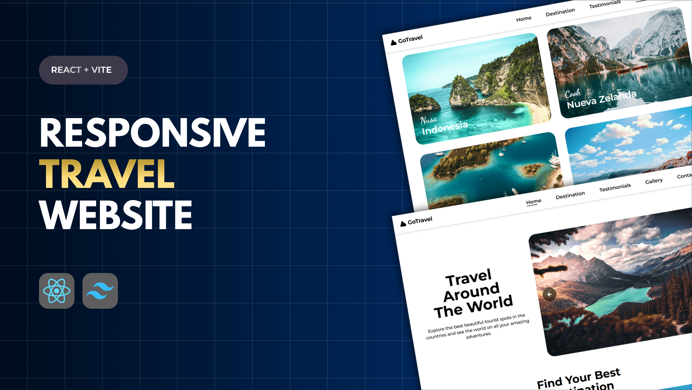

# GoTravel

GoTravel is a simple travel-themed website built using React, Vite, and Tailwind CSS.  
This project was created to practice React component structure, responsive layouts, and modern frontend development.

The website mainly showcases travel destinations with beautiful images and a clean UI.

---

## Live Demo
https://gotravel-online.vercel.app

---

## Preview

---

## Features
- Responsive navigation bar
- Mobile menu toggle
- Destination showcase
- Image gallery section
- Testimonials section
- Smooth UI with Tailwind CSS
- Fully responsive design

---

## Tech Stack
- React
- Vite
- Tailwind CSS
- JavaScript (ES6+)
- Remix Icons

---

## Purpose of this Project

This project was built to practice:
- React component-based architecture
- State management with useState
- Responsive design using Tailwind CSS
- Mobile navigation menu
- Basic frontend project structure

---

## Future Improvements
- Add animations
- Add routing with React Router
- Add backend for dynamic content
- Add booking functionality

---

## Author

Ragunath S  
GitHub: https://github.com/Ragunath-1014

---

⭐ If you like this project, please consider giving it a star on GitHub!
